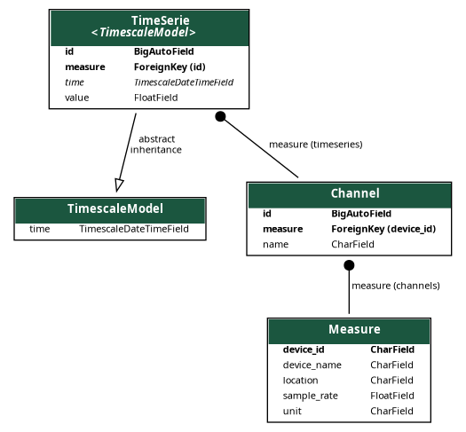

TimeScaleDB App
===============

The TimeScaleDB App is a Django app designed to work with TimeScaleDB, a
time-series database built on top of PostgreSQL. The app provides models
for storing time-series data in the database, including information
about the measuring device, its channels, and the time series data
itself.

Functionality
-------------

The app includes the following models:

-  Measure: stores metadata of a measuring device.
-  Channel: stores the channels of a measuring device.
-  TimeSerie: stores the time series data for a specific channel.

The app is compatible with Django 3.x and TimeScaleDB 2.x.

For more information on TimeScaleDB, please refer to the official
documentation: https://docs.timescale.com/latest/main/

   Database model
